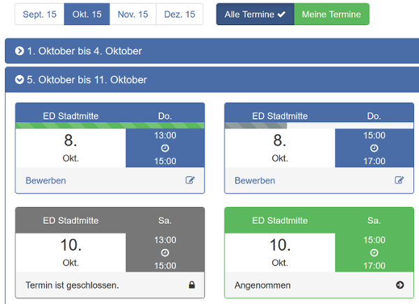
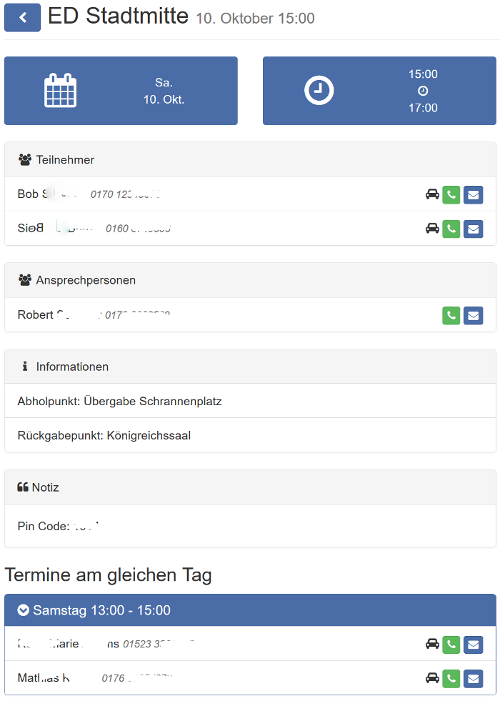
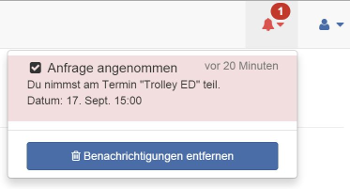

# Benutzeranleitung

Diese Anleitung dient dazu, das öffentliche Zeugnisgeben mit einer lange bewährten Internetanwendung zu planen und durchzuführen.

Wir haben uns größte Mühe gegeben, sehr viel Zeit und geistige Kraft investiert, um diese Software für diesen Zweck zu erstellen. Die Internetanwendung erleichtert Dir und auch den Verantwortlichen das Organisieren des öffentlichen Zeugnisgebens, um auch hier „alle Dinge anständig und nach Anordnung geschehen (zu lassen)“, wodurch Jehovas Name sehr geehrt wird. (1. Kor. 14:40)

## Voraussetzung zur Teilnahme
Die Teilnahme an unserem Programm ist freiwillig und beginnt mit einer Registrierung für eine Gruppe Deiner Versammlung. Dafür wird mindestens ein Gruppenkoordinator von Deiner Versammlung bestimmt, der dann einen Link zur eigenen Gruppe (Versammlung) bekommt. Dieser muss vorher eine Gruppe für Deine Versammlung beim Administrator beantragt haben. Das kann über das Kontaktformular auf der Startseite gemacht werden. Alles weitere bereitet dann der Gruppenkoordinatoren für Dich vor und erstellt Termine für euren Bedarf.
## Registrierung
Wenn Dein Gruppenkoordinator mit den Vorbereitungen fertig ist, erhältst Du von ihm einen gültigen Registrierungslink. Dieser wird in der Regel per Email versendet.
Beispiel: „https://jw-public.org/gruppe/ab....73T8/registrierung“.
Für eine erfolgreiche Registrierung benötigst Du eine gültige E-Mail Adresse. Diese E-Mailadresse ist gleichzeitig auch Dein Benutzername für zukünftige Anmeldung am „Public Assistant“. Jeder Teilnehmer benötigt seine eigene E-Mailadresse. Bitte nutze eine Adresse die Du längere Zeit verwendest. Warum? Da über diese E-Mailadresse dein Passwort zurückgesetzt werden kann. Weitere Info dazu siehe unten. Eine doppelte Registrierung mit einer anderen E-Mailadresse ist nicht erlaubt und wird abgewiesen. Sollte sich Deine E-Mailadresse ändern, wende dich bitte an deinen Trolleykoordinator. Alle Daten, die Du bei der Registrierung eingibst, können von Dir auch wieder geändert werden. So auch z.B. Deine Telefonnummer.
###Schritt eins
Wenn dein Gruppenkoordinator Dir eine Email mit dem Registrierungslink zugesendet hat, kopierst Du den Link in das Adressfeld eines Internetbrowsers Deiner Wahl wie z.B. Mozilla Firefox oder ähnlichem. Alternativ kann, je nach E-Mail Programm, der Link angeklickt werden und dieser öffnet dann automatisch einen Browser.
###Schritt zwei
Hier gibst Du Deine persönlichen Daten in die Eingabefelder ein.
Nach erfolgreicher Registrierung wird Deine Anfrage bearbeitet und vom zuständigen Bruder freigeschaltet.
Eine erneute Registrierung mit der gleichen E-Mailadresse ist nicht möglich.

##Anmeldung
Nach einer erfolgreichen Registrierung bleibt die Sitzung (Verbindung zum Server) normalerweise bestehen, bis Du Dich abmeldest oder an einem anderen Gerät anmelden möchtest. Dann ist eine Anmeldung mit der zuvor registrierten E-Mail Adresse und Deinem persönlichen Passwort erforderlich.
Wichtig: Für die Anmeldung verwendest Du die folgende Internetadresse:
[jw-public](https://jw-public.org)
Tipp: Am besten Du speicherst diese Adresse als Favorit ab. So findest Du diese Anwendung schnell wieder.

##Terminübersicht
Wenn die Freischaltung erfolgt ist, werden Dir alle Termine in der Terminübersicht angezeigt, für die Du Dich bewerben kannst.

##Für einen Termin bewerben
Wenn Du Dich für einen bestimmten Termin bewerben möchtest, dann klickst Du bei Diesem auf „Bewerben“. Dieser Termin gilt dann solange als beworben (gelb) bis Du entweder angenommen (grün) oder leider vom Koordinator abgelehnt wurdest. Das ist dann meistens der Fall, wenn nicht alle Bewerber angenommen werden können. Bitte probiere eine erneute Bewerbung für einen anderen Termin. Du kannst Dich auch für mehrere Termine gleichzeitig bewerben.
Wenn Du einen grünen Balken über dem Datum und Uhrzeit siehst, dann ist der Termin schon sehr voll, aber dennoch ist ein Bewerben möglich und auch sinnvoll.

*Bild: zeigt eine Termiübersicht*

Hier ist eine Zusammenfassung der Bedeutung der Farben zu den Terminen:

| Farbe | Bedeutung |
| ------------ | ------------- |
| grau | Termin ist geschlossen und kann nicht beworben werden.  |
| blau | Dieser Termin kann beworben werden.  |
| gelb | Ein gelber Termin ist Beworben. Die Bewerbung kann wieder zurückgezogen werden.  |
| grün | Dieser Termin ist bestätigt. Es können die Details zum Termin eingesehen werden. |
| rot  | Der Termin wurde aus gegebenem Anlass abgebrochen. Z.B. wegen Unwetter. |

##Informationen zum Termin anzeigen
Nur für angenommene (grüne) Termine  können Informationen (Details) angezeigt werden. Diese Infos enthalten alles Wissenswerte für die Durchführung des Dienstes und kann so aussehen wie abgebildet:

*Bild: Termindetails eines angenommenen Termins*

Diese Informationen kannst Du Dir anzeigen lassen, wenn Du einen Klick auf „Angenommen“ in einem grünen (bestätigten) Termin machst.
In den Notizen werden Dir zusätzliche Informationen zur Verfügung gestellt.
Im unteren Bereich werden Kontaktinformationen zu relevanten Terminen angezeigt, da diese bei Bedarf eine wertvolle Hilfe sein könne, um sich telefonisch in Verbindung setzen zu können.

Wichtig: Bitte schau Dir immer vor Deinem Termin diese Informationen an, damit Du auf kurzfristige Änderungen reagieren kannst. Wenn ein Termin kurzfristig abgesagt werden muss, z.B. wegen Unwetter, ist dieser rot dargestellt und bei einem Klick darauf, kann man den Grund dafür sehen.

Tipp: Wenn Du diesen Termin mit einem internetfähigen Smartphone öffnest, kannst Du die Telefonnummer Durch einen Klick auf das Telefonsymbol wählen lassen. Drückst Du auf das E-Mail Symbol, kannn damit eine neue Email geöffnet. So kannst Du zu jederzeit Kontakt aufnehmen, falls das für Dich erforderlich ist. Dafür sind Deine persönlichen Daten sehr wichtig und sollten immer aktuell gehalten werden.
Bitte beachte:
Wenn Du aus persönlichem Anlass einen bereits bestätigten Termin (grün) absagen musst, dann setze Dich bitte so früh wie möglich mit dem zuständigen Bruder in Verbindung, der unter „Ansprechperson“ steht.

##Benachrichtigungen
Wichtige Benachrichtigungen zu Deinen Terminen, werden Dir über das Symbol angezeigt. Hierüber wirst Du informiert wenn Deine Bewerbung angenommen oder abgelehnt bzw. abgesagt werden musste. Wenn Du die Nachricht anklickst, kommst Du bei einem angenommenen Termin sogar Direkt zur Detailansicht des Termins. Die rote Markierung verschwindet, wenn alle neuen Termine gelesen wurden.

*Bild: Benachrichtigung für einen Termin*

##Persönliche Daten ändern
Deine persönlichen Daten kannst Du zu jeder Zeit ändern. Dies kann zum Beispiel erforderlich werden, wenn sich Deine Telefonnummer geändert hat.
Zum Ändern klickst Du auf das Symbol neben der Glocke und wählst „Meine Daten“ aus. Du kannst alle persönlichen Daten ändern, nur nicht die E-Mail Adresse.  Für eine Änderung Deiner E-Mailadresse, setze Dich bitte mit einem zuständigen Bruder in Verbindung.
Unter persönliche Daten, kannst Du auch dein Passwort ändern.
Bitte halte stets Deine Daten aktuell.

##Passwort vergessen
Nach einem Klick auf „Passwort vergessen?“ in der Anmeldemaske, wirst Du aufgefordert Deine E-Mail Adresse einzugeben, die im „Public Assistant“ registriert wurde.

In Deinem E-Mail Postfach sollte nach erfolgreichem Absenden eine E-Mail ankommen, mit der Du Dein Passwort ändern kannst. Weitere Informationen erhältst Du mit der zugesendeten E-Mail.
###Hinweis: Darum ist eine aktuelle E-Mailadresse so wichtig!
Sollte sich Deine E-Mailadresse geändert haben, teile es bitte Deinem zuständigen Bruder in Deiner Versammlung mit. Dieser wird das dann über ein Problemticket an den Administrator weiterleiten.

##Abmelden
Abmelden kannst Du Dich mit einem Klick auf das Symbol neben der Glocke und wählst dann „Abmelden“. Auf deinem persönlichen Computer oder Smartphone musst Du Dich nicht immer zwangsweise abmelden.
###Wichtiger Hinweis!
Solltest Du Dich einmal an einem öffentlich zugänglichen PC anmelden, dann melde Dich auf alle Fälle nach Abschluss Deiner Tätigkeit vom „Public Assistant“ wieder ab. Bitte beachte das unbedingt, sonst kann jemand mit Deinem Zugang Unfug anstellen!!!

##Schlußwort
Wir freuen uns über eine rege Nutzung dieser neuen technischen Möglichkeit, unseren Dienst für Jehova geordnet Durchführen zu können!

Dein Organisationsteam
